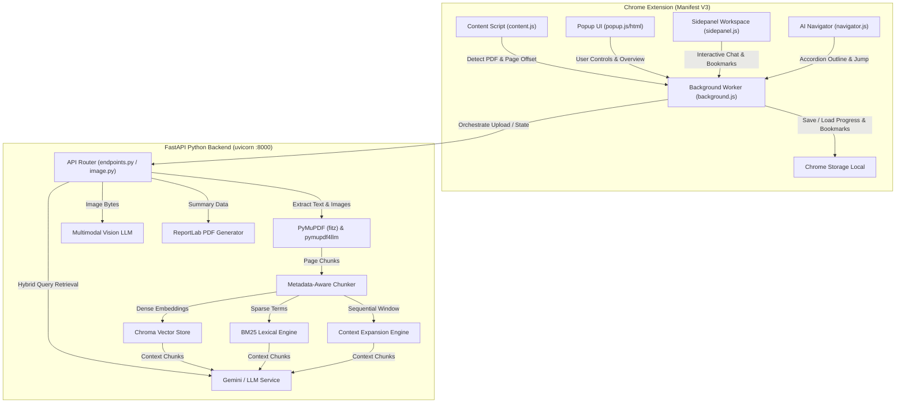

# 📄🤖 DocLens-AI (AI PDF Assistant) — Master Technical Documentation

> **Complete Project Specification, Architectural Blueprint, Working Flow, & Feature Catalog**

---

## 📌 Executive Overview

**DocLens-AI** is an advanced, privacy-aware **Browser Extension (Chrome Manifest V3)** seamlessly integrated with a high-performance **FastAPI (Python 3.13) AI Backend**. It turns passive PDF reading into an interactive, structured, and intelligent workspace.

DocLens-AI parses complex document layouts, extracts mathematical equations, tabular structures, visual figures,Courier-formatted code, and hyperlinks, enabling real-time **Multimodal Image Analysis**, **Hybrid RAG Chat (Dense Vector + BM25 Lexical Reranking)**, **Collapsible Sidebar Navigation**, **Bookmark & Progress Tracking**, and **Exportable Executive PDF Summaries**.

---

## 🏗️ System Architecture & Data Workflow



### End-to-End Operation Flow

1. **PDF Detection & Loading**:
   - The user opens a PDF in Chrome (either `http(s)://` or local `file://` URL).
   - `content.js` identifies the embedded viewer, extracts document title/URL, and notifies `background.js`.
2. **Ingestion & Parsing**:
   - `background.js` dispatches the PDF payload to `/upload-pdf` or `/upload-local-pdf`.
   - The backend runs layout-aware parsing (`pymupdf4llm`), extracts text, headers, images, equations, and tables while preserving page number metadata.
3. **Indexing & Hybrid RAG Initialization**:
   - Chunks are vectorized into **ChromaDB**, tokenized for **BM25 Lexical Search**, and loaded into the **Context Expansion Engine**.
   - Figures, tables, definitions, formulas, and topics are registered in dedicated backend memory services.
4. **Interactive Exploration & AI Features**:
   - **Navigator**: Automatically renders structured collapsible accordions in the Sidepanel.
   - **Chat**: Hybrid retrieval pulls top matching chunks, applies Reciprocal Rank Fusion & reranking, expands context, and generates grounded responses with page citations.
   - **Explain Image**: Image cards trigger Vision LLM evaluation.
   - **PDF Generation**: Users download custom formatted PDF summary sheets directly generated via ReportLab.

---

## ⭐ Comprehensive Feature Catalog

### 1. 📚 AI Document Navigator (Structured Accordions)
Automatically reorganizes the PDF into 8 dynamic, collapsible sections in the sidepanel:
- **📑 Chapters & Headings**: Deep hierarchical table of contents with page links.
- **⭐ Definitions**: Extracted terms with context-aware definitions.
- **🧮 Formulas & Equations**: Formatted mathematical formulas highlighted in visual containers.
- **📊 Figures & Tables**: Structured tabular data and figure references.
- **🖼 Image Cards**: Extracted inline images with instant AI analysis triggers.
- **💻 Code Blocks**: Courier-styled syntax blocks captured from code listings.
- **🔗 Document Links**: Interactive web links and plain-text URLs normalized via clean regex.
- **🏷️ Frequently Mentioned Topics & References**: Key entities, terms, and cross-references.

### 2. 💬 Grounded AI Chat with Citations & Highlighting
- **Hybrid Search**: Combines Dense Vector Search (semantic similarity) and Sparse BM25 (exact keyword matching).
- **Query Rewriting & Context Expansion**: Expands user queries to capture context across adjacent pages.
- **Citation Badges**: Answers include clickable page source tags `[Page X]`.
- **Targeted Page Jumping**: Clicking a page tag communicates with `content.js` to immediately scroll to and highlight the relevant section.

### 3. 🖼 Multimodal Image Analysis ("Explain Image")
- Extracts images directly from PDF byte streams.
- Provides base64 image serving endpoint `/image/{image_id}`.
- Sends visual content to Multimodal Vision AI to break down:
  1. *Important Components*
  2. *Structural Relationships*
  3. *Key Takeaways*
  4. *Real-World Applications*

### 4. 📑 Bookmark & Reading Progress Manager
- **Progress Auto-Save**: Saves reading position, scroll offset, page percentage, and last-read timestamp per PDF hash.
- **Global & PDF-Specific Bookmarks**: Add custom bookmarks with custom notes/labels.
- **Manageable UI**: Rename, edit notes, delete, or jump directly from the sidepanel.

### 5. 🖨 Premium PDF Executive Summary Sheet Generator
Generates a downloadable, professionally formatted PDF summary sheet via Python ReportLab:
- **Overview Grid**: Document metadata, page count, word count, reading time, difficulty level.
- **Slate Blue Modern Aesthetics**: Dark theme visual hierarchy, monospaced code styling, and equation containers.
- **Embedded Clickable Links**: Active hyperlinks embedded directly into the generated PDF document.

### 6. 🌐 Local (`file://`) & Remote (`http(s)://`) PDF Compatibility
- Full support for Chrome local file access (`file:///*`).
- Handles CORS cross-origin requests seamlessly for local development and extension runtime environment.

---

## 📂 Project Directory Structure

```
DocLens-AI/
├── manifest.json                     # Chrome Extension Manifest V3 Configuration
├── README.md                         # Project Readme & Overview
├── requirements.txt                  # Python Dependencies
├── assets/                           # Extension Icons & Static Resources
│   ├── icons/                        # 16px, 32px, 48px, 128px App Icons
│   └── pdf.worker.min.js             # PDF.js Web Worker
├── backend/                          # FastAPI Backend Application
│   ├── main.py                       # Application Entry Point & CORS Setup
│   ├── api/                          # REST API Routes
│   │   ├── endpoints.py              # Main API Controllers (Upload, Chat, Summarize, Navigator)
│   │   └── image.py                  # Image Serving & Vision LLM Endpoints
│   ├── core/                         # Configuration & Settings
│   │   └── config.py                 # Environment Variables & LLM Keys
│   ├── models/                       # Pydantic Schemas & DTOs
│   │   └── schemas.py                # Request/Response Validation Schemas
│   └── services/                     # Core Business Logic Services
│       ├── bm25_service.py           # Lexical Keyword Search
│       ├── chunk_service.py          # Metadata-Aware Document Chunking
│       ├── citation_service.py       # Grounding & Page Source Extraction
│       ├── context_expansion_service.py # Context Window Stitching
│       ├── embedding_service.py      # Dense Embedding Generation
│       ├── figure_service.py         # Figure Identification & Extraction
│       ├── grounding_service.py      # Verification & Response Grounding
│       ├── hybrid_retriever_service.py # RRF Vector + BM25 Fusion
│       ├── image_service.py          # Image Extraction & Storage
│       ├── llm_service.py            # Generative LLM Communication
│       ├── navigator_service.py      # Structured Accordion Generator
│       ├── pdf_generator_service.py  # ReportLab PDF Exporter
│       ├── pdf_service.py            # PyMuPDF Layout Parsing
│       ├── query_rewriter_service.py # RAG Query Optimizations
│       ├── rate_limiter_service.py   # API Throttling Protection
│       ├── reranker_service.py       # Cross-Encoder Reranking
│       ├── retriever_service.py      # Primary Retrieval Interface
│       ├── table_service.py          # Tabular Data Extractor
│       ├── topic_service.py          # Entity & Topic Aggregator
│       ├── vector_service.py         # Chroma Vector Store Handler
│       └── vision_service.py         # Vision Model Image Analysis
├── background/                       # Extension Service Worker
│   └── background.js                 # Event Listener & Backend Relay
├── content/                          # Web Page Injector
│   └── content.js                    # PDF Viewer Interop, Scroll Sync & Highlighting
├── popup/                            # Extension Action Popup
│   ├── popup.html                    # Quick Action Dashboard HTML
│   ├── popup.css                     # Dark Glassmorphism Styling
│   └── popup.js                      # Popup Event Controllers
├── sidepanel/                        # Main Workspace Panel
│   ├── sidepanel.html                # Main Interface HTML
│   ├── sidepanel.css                 # Premium Styling System
│   ├── sidepanel.js                  # Chat, Bookmarks & State Manager
│   └── navigator.js                  # Accordion Renderer & Interaction Handler
├── services/                         # Extension Frontend Services
│   ├── ai-service.js                 # API Proxy for AI Calls
│   ├── api-service.js                # Fetch Wrapper & Error Handler
│   ├── bookmark-service.js           # Chrome Storage Bookmark Manager
│   ├── pdf-service.js                # Frontend PDF Parsing Helpers
│   └── storage-service.js            # Reading Progress Persistence
├── utils/                            # Frontend Utilities
│   ├── constants.js                  # System Constants & Endpoint URLs
│   ├── helper.js                     # DOM & String Helpers
│   └── validator.js                  # Input & Path Validators
└── options/                          # Options Page (Extension Config)
    ├── options.html                  # Settings HTML
    └── options.js                    # API Key & Theme Configurations
```

---

## 📡 REST API Endpoint Reference

| Endpoint | Method | Input Payload | Description |
| :--- | :--- | :--- | :--- |
| `GET /` | `GET` | None | Health check endpoint returning API status. |
| `POST /upload-pdf` | `POST` | `multipart/form-data` (file) | Uploads PDF, parses text/images, chunks, embeds in Chroma, indexes BM25, registers navigator components. |
| `POST /upload-local-pdf` | `POST` | JSON `{ file_path }` | Loads local file directly from system path for `file://` protocol. |
| `GET /current-document` | `GET` | None | Retrieves metadata of currently active PDF document in backend memory. |
| `POST /clear-document` | `POST` | None | Clears active vector stores, BM25 indices, and memory registries. |
| `POST /chat-pdf` | `POST` | JSON `{ query, history }` | Executes Hybrid RAG search, query rewriting, context expansion, and returns grounded answer with page citations. |
| `POST /explain-image` | `POST` | JSON `{ image_id / base64 }` | Analyzes specified image using Vision LLM. |
| `POST /summarize-pdf` | `POST` | JSON `{ summary_type }` | Generates document overview, executive summary, key takeaways, and difficulty metrics. |
| `POST /create-navigator` | `POST` | `multipart/form-data` (file) | Generates structured accordion layout response for uploaded PDF. |
| `POST /create-local-navigator`| `POST` | JSON `{ file_path }` | Generates structured accordion layout response for local filesystem PDF. |
| `POST /download-navigator-pdf` | `POST` | `multipart/form-data` (file) | Returns generated ReportLab summary `.pdf` byte stream. |
| `POST /download-local-navigator-pdf` | `POST` | JSON `{ file_path }` | Returns generated ReportLab summary `.pdf` byte stream for local file. |
| `GET /image/{image_id}` | `GET` | Path Param `image_id` | Serves base64/binary image extracted from document. |

---

## ⚙️ Technical Stack Summary

### **Frontend Extension (Chrome MV3)**
- **Architecture**: Chrome Extension Manifest V3 (Service Worker + Content Scripts + Side Panel API + Storage API).
- **Styling**: Modern CSS3 Dark Mode with Glassmorphism aesthetic, Google Inter/Roboto fonts, smooth CSS micro-animations.
- **Scripting**: Pure JavaScript (ES6+), PDF.js interop.

### **Backend Application**
- **Framework**: FastAPI (Python 3.13) running on Uvicorn server.
- **PDF Extraction**: `PyMuPDF` (`fitz`), `pymupdf4llm` (Layout-aware Markdown/Structure parser).
- **Search & Retrieval (RAG)**: Dense Vector Search (Chroma DB) + Sparse Lexical Search (BM25) + RRF Reranking.
- **Generative AI & Vision**: Google Gemini API / Vision Multimodal LLM integration.
- **PDF Export**: ReportLab PDF library with custom Canvas styling.

---

## 🚀 Execution & Verification Workflow

1. **Start Backend Server**:
   ```bash
   cd d:\DocLens-AI\backend
   uvicorn main:app --reload --host 127.0.0.1 --port 8000
   ```
2. **Load Chrome Extension**:
   - Navigate to `chrome://extensions/`
   - Enable **Developer mode** (top right).
   - Click **Load unpacked** and select `d:\DocLens-AI`.
3. **Usage**:
   - Open any PDF in Chrome.
   - Click the extension icon to open the **Sidepanel** or **Popup**.
   - Browse the **AI Navigator**, ask questions in **Chat**, inspect images, set bookmarks, or download the executive PDF summary sheet.
